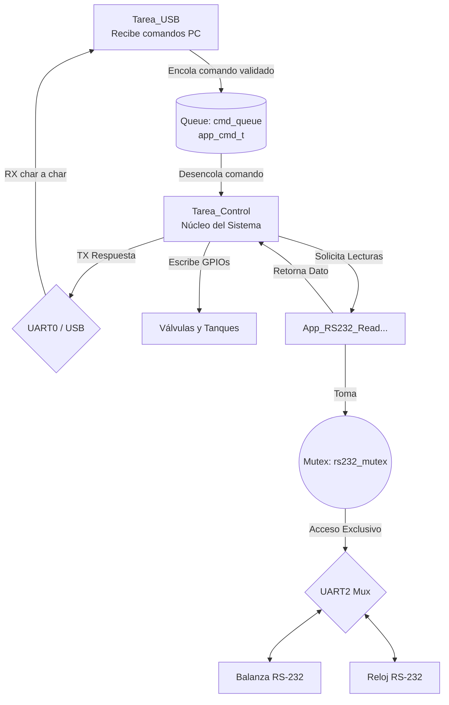
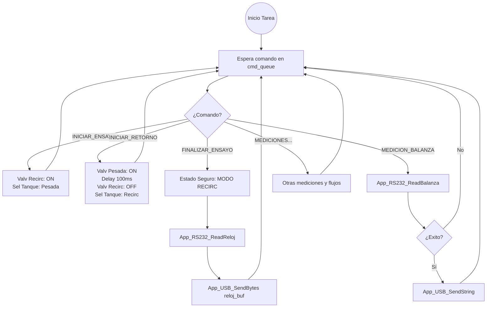
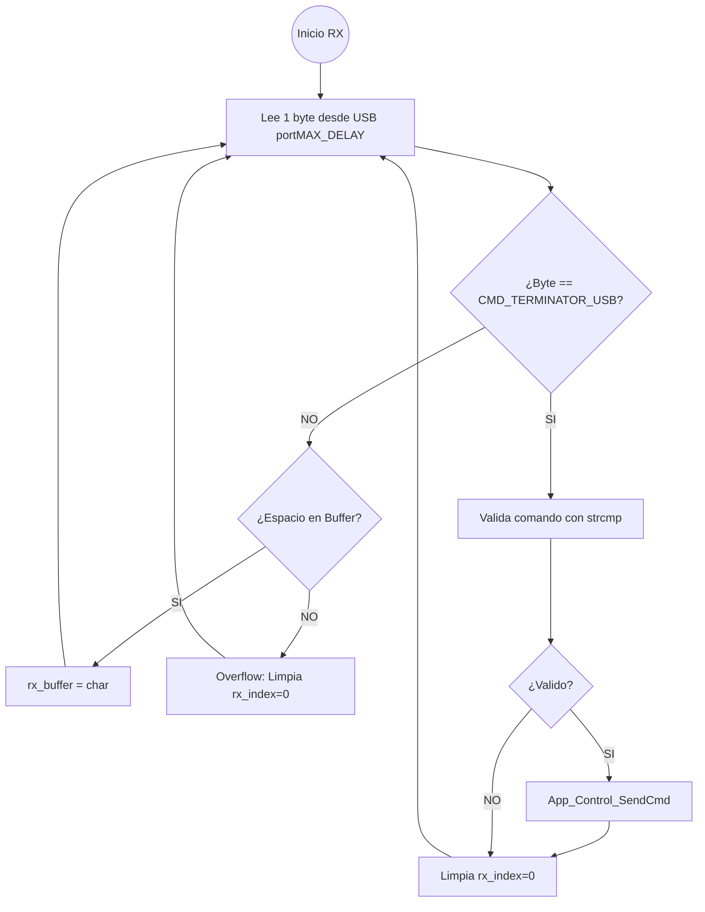
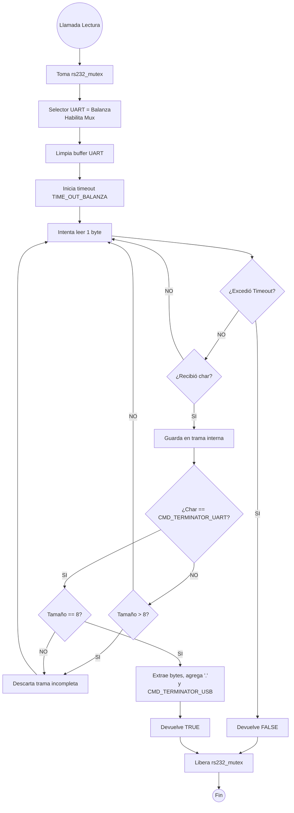

# Documentación Técnica del Firmware

Este documento detalla la implementación a nivel de código del firmware, estructurada bajo el sistema operativo FreeRTOS. Se incluyen diagramas de arquitectura y flujo, detalles sobre el manejo de recursos compartidos (colas y semáforos) y la referencia de la API interna organizada por archivos.

---

## 1. Arquitectura General y Tareas del Sistema

El firmware emplea tres tareas concurrentes que interactúan mediante mecanismos de IPC (Inter-Process Communication) de FreeRTOS para garantizar la asincronía y proteger recursos compartidos:

---

## 2. Descripción de Módulos y API Interna

### `board_config.h`
Contiene todas las definiciones preprocesadas que configuran el comportamiento del hardware, pines, lógicas activas y tiempos de espera.

- **Macros destacadas:**
  - `CMD_TERMINATOR_USB` y `CMD_TERMINATOR_UART`: Caracteres de finalización de trama (`\0` y `\r`).
  - `COMANDO_RELOJ`: Byte que se envía al reloj para solicitar el tiempo (`100`).
  - Lógica de Válvulas: `LOGIC_VALV_RECIRC_ACTIVE`, `LOGIC_VALV_PESADA_ACTIVE`.
  - Tiempos de timeout: `TIME_OUT_BALANZA` (3000ms), `TIME_OUT_RELOJ` (1000ms).

---

### `app_usb_task.c` / `.h`
Gestiona la recepción y el envío de datos por el puerto USB-UART.

- **Prototipos:**
  - `void App_USB_Init(void);`: Inicializa y crea la tarea de recepción USB.
  - `void App_USB_SendString(const char *str);`: Envía un string terminado en nulo (`\0` implicado por `strlen`).
  - `void App_USB_SendBytes(const uint8_t *data, size_t len);`: Envía un array de bytes crudos a la PC.
- **Lógica Interna (Tarea `app_usb_rx_task`):**
  Lee la UART0 de manera bloqueante (basado en interrupciones) byte a byte. Acumula en `rx_buffer` hasta encontrar `CMD_TERMINATOR_USB`. Luego usa `strcmp` para identificar el comando (`app_cmd_t`) y lo pasa a la capa de control vía `App_Control_SendCmd()`.

---

### `app_control.c` / `.h`
Módulo orquestador del firmware. Gestiona las válvulas y ejecuta la lógica de negocio basándose en los comandos recibidos en su cola.

- **Prototipos:**
  - `void App_Control_Init(void);`: Crea `cmd_queue`, inicializa pines GPIO y establece el modo de recirculación inicial.
  - `void App_Control_SendCmd(app_cmd_t cmd);`: Función llamada por otras tareas para inyectar comandos.
  - `void App_Control_Task(void *pvParameters);`: Bucle infinito de procesamiento principal.
- **Manejo de `cmd_queue`:**
  Si ingresa un comando crítico de control de estado (`CMD_INICIAR_ENSAYO`, `CMD_INICIAR_RETORNO`, `CMD_FINALIZAR_ENSAYO`, `CMD_FINALIZAR_RETORNO`), se limpia la cola actual de inmediato usando `xQueueReset()`. Esto asegura que el firmware no demore cambiando estados críticos si había comandos de medición apilados.

---

### `app_rs232_task.c` / `.h`
Controla el acceso al puerto UART2 y al hardware de multiplexación.

- **Prototipos:**
  - `void App_RS232_Init(void);`: Instancia el `rs232_mutex` para proteger el bus.
  - `bool App_RS232_ReadBalanza(char *out_buffer);`: Lee el peso formateado.
  - `bool App_RS232_ReadReloj(char *out_buffer);`: Lee el tiempo y lo convierte a formato cadena.
- **Protección Concurrente:**
  Tanto la balanza como el reloj exigen manipular los pines `hab_mux` y `selector_uart`. Ambas funciones engloban todo su flujo en un `xSemaphoreTake()` y `xSemaphoreGive()`.

---

## 3. Diagramas de Flujo por Tarea

### Flujo: Tarea de Control (`App_Control_Task`)

Esta tarea bloquea hasta tener comandos. Destaca el tratamiento inmediato ante comandos de finalización.

### Flujo: Recepción USB (`app_usb_rx_task`)

### Flujo: Lectura de Balanza RS-232 (`App_RS232_ReadBalanza`)

